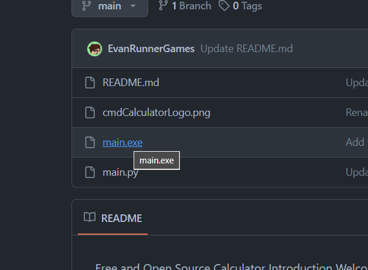
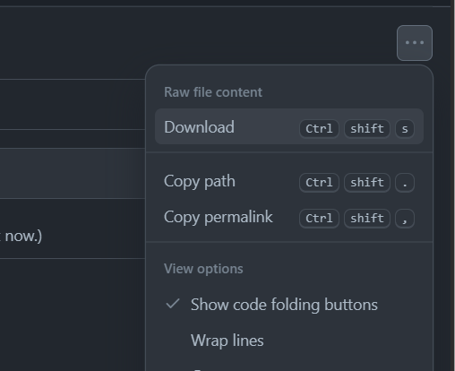
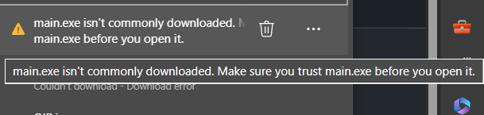
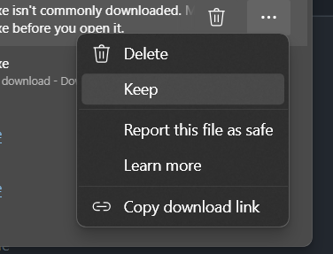
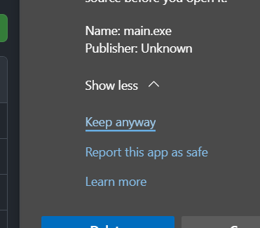
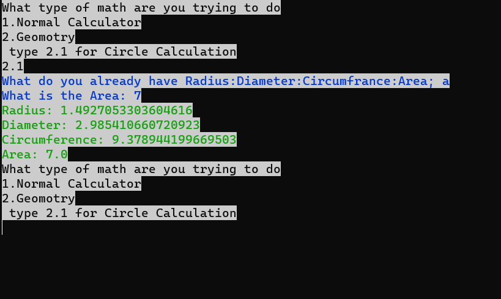

Reasons to use cmd_Calculator:
#Its a light weight solution it is running in the command line
#but eitherwase calculators are light weight
#but this calculator will take little to no memory its like how opra gx takes less than google well this does to
#
#and here are some more reasons
#Free and Open Source Calculator
#Introduction
#Welcome to our project! This is not your ordinary calculator. Designed to make math homework easier, this tool is perfect for when you have certain #measurements (like area, radius, diameter, or circumference) and need to find the unknowns. Simply input what you have, and let the calculator find what ?#you're missing.

#and if you do contribute thanks I only have a hour during the week to work on it and all day on weekends so during the week I dont get much time because I #have to study for my test

Features
Ease of Use: Just input the measurements you have, and the calculator does the rest.
Supports Various Measurements: Works with area, radius, diameter, and circumference.
Open Source: Feel free to contribute or fork this project to make it even better!
How to Use
Start the calculator.
Input the measurement you have (e.g., area, radius, diameter, circumference).
Enter the numerical value of your input.
The calculator will compute and provide the unknown measurements.
We also have other calculator options such as Normal Calculator and "Algebra that does Algebra that finds x or any other unknow value" - THE TEXT IN QUOTES IS COMING SOON

Installation:
Just dowload the main.exe file and double click it then your in the calculator it will open in a terminal/command line window

?If it did not let you dowload then go to dowloads ----> 3 DOTS -----> KEEP -----> SHOW MORE -------> KEEP ANYWAY
?The reason your computer thinks this file might be unsafe is because it is written in python and you computer says wait this file is not commonly dowloaded, #the reason for this is because this is a small project and not really anybody has dowloaded it so it is not really know

